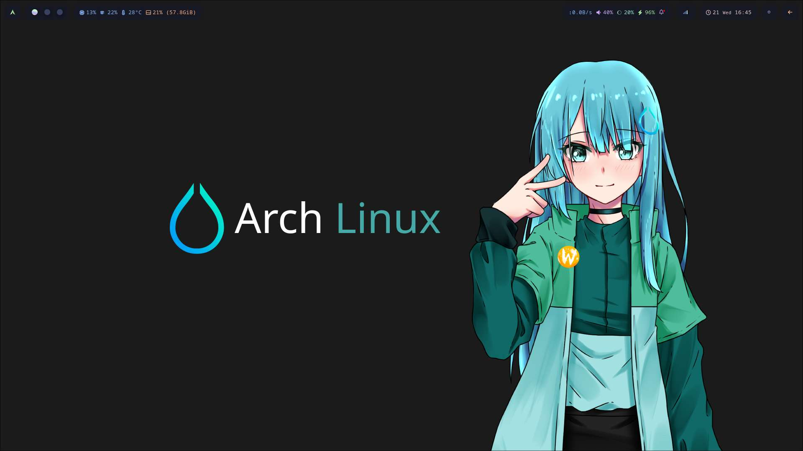
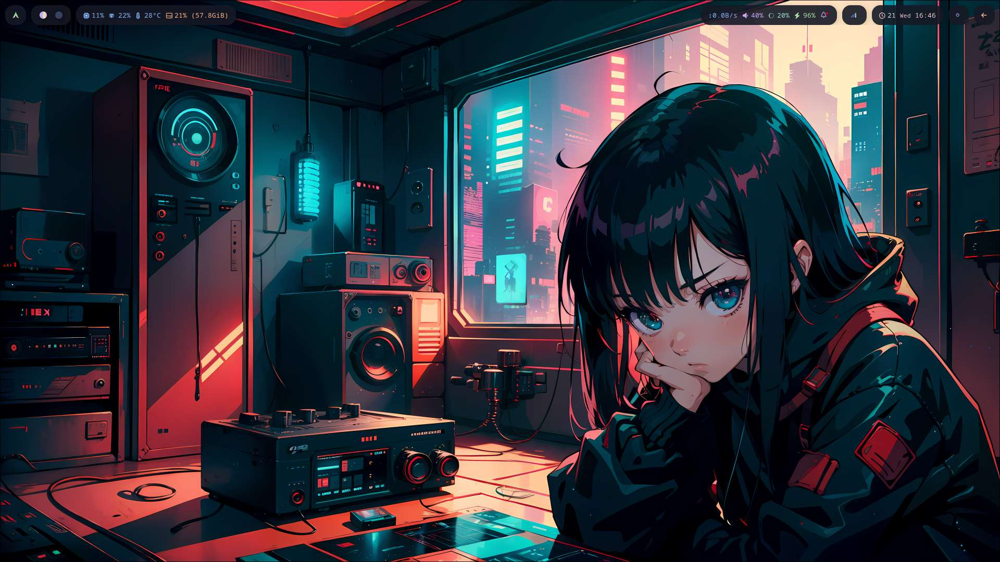
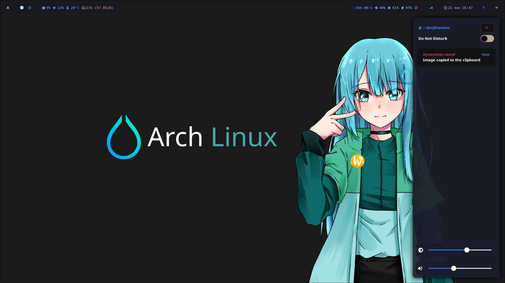
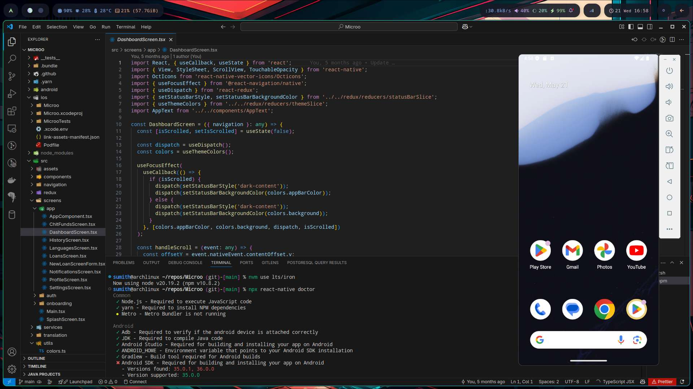

# 🌌 Hyprland Dotfiles

Welcome to my personal [Hyprland](https://github.com/hyprwm/Hyprland) dotfiles 

This repo includes my entire desktop environment configuration, including Hyprland, Waybar, Wofi, Kitty, btop, and more — along with helpful scripts and wallpapers to create a fully-featured, keyboard-driven Wayland setup.

---

## 📦 What's Included?

- 🎛️ Hyprland config (`hyprland.conf`, `hyprpaper.conf`)
- 🐈 Kitty with custom themes
- 📊 btop for monitoring
- 🖼️ Dynamic wallpapers (hyprpaper + `shared/wallpapers`)
- 🛠️ Waybar, Wofi, Swaync, and Picom configs
- 📸 Screenshot, lock, and theme utility scripts
- 🎨 Terminal color themes & UI customization
- 🌍 Scripts for weather, updates, and more

---

## 📂 Directory Structure

```bash
.
├── dotfiles/config        # All config files
├── scripts/               # Utility and automation scripts
├── shared/wallpapers/     # Wallpaper collection
├── pics/                  # Example images
└── setup.sh               # Auto-setup script
```

---

## ⚙️ Getting Started

> 🧠 Make sure you're on a Wayland-compatible system using Hyprland.

### ✅ Installation

Clone this repo and run the setup script:

```bash
git clone https://github.com/sumithemmadi/hyprland-dotfiles.git
cd hyprland-dotfiles
chmod +x setup.sh
./setup.sh
```

This script will copy the necessary config files to your home directory.

---

## 📸 Screenshots






---

## 💡 Requirements

- Hyprland
- Waybar
- Kitty
- Wofi
- Fonts
- More


---

## 🔑 Modifier Key

```ini
$mainMod = SUPER
```

The `SUPER` key (Windows key) is used as the primary modifier.

## 🖥️ Application Launchers

| Keybind   | Action                           |
| --------- | -------------------------------- |
| SUPER + Q | Launch terminal (`kitty`)        |
| SUPER + E | Launch file manager (`nautilus`) |
| SUPER + R | Launch app launcher (`wofi`)     |
| SUPER + W | Launch Brave via custom script   |

---

## 🗔 Window Management

| Keybind     | Action                             |
| ----------- | ---------------------------------- |
| SUPER + C   | Close active window (`killactive`) |
| SUPER + V   | Toggle floating window             |
| SUPER + F   | Toggle fullscreen                  |
| SUPER + Tab | Cycle to next window (`cyclenext`) |
| SUPER + P   | Toggle pseudotiling (dwindle)      |
| SUPER + J   | Toggle split orientation (dwindle) |

### Move Focus

| Keybind             | Action            |
| ------------------- | ----------------- |
| SUPER + Left Arrow  | Focus left window |
| SUPER + Right Arrow | Focus right       |
| SUPER + Up Arrow    | Focus up          |
| SUPER + Down Arrow  | Focus down        |

---

## 🧭 Workspaces

### Switch Workspaces

| Keybind        | Action            |
| -------------- | ----------------- |
| SUPER + \[1–0] | Switch to WS 1–10 |

### Move Windows to Workspaces

| Keybind                | Action                 |
| ---------------------- | ---------------------- |
| SUPER + SHIFT + \[1–0] | Move window to WS 1–10 |

### Scroll Through Workspaces

| Keybind             | Action            |
| ------------------- | ----------------- |
| SUPER + Scroll Up   | Go to previous WS |
| SUPER + Scroll Down | Go to next WS     |

---

## 🧙 Special Workspace

| Keybind           | Action                           |
| ----------------- | -------------------------------- |
| SUPER + S         | Toggle special workspace `magic` |
| SUPER + SHIFT + S | Move window to `magic` workspace |

---

## 🐭 Mouse Bindings

| Mouse Action              | Description   |
| ------------------------- | ------------- |
| SUPER + Left Click (272)  | Move window   |
| SUPER + Right Click (273) | Resize window |

---

## 🔊 Volume Controls

| Keybind              | Action                        |
| -------------------- | ----------------------------- |
| XF86AudioLowerVolume | Decrease volume by 2%         |
| XF86AudioRaiseVolume | Run script to increase volume |
| XF86AudioMute        | Toggle mute                   |

---

## 🎵 Media Controls

| Keybind       | Action           |
| ------------- | ---------------- |
| XF86AudioPlay | Play/Pause media |
| XF86AudioNext | Next track       |
| XF86AudioPrev | Previous track   |
| SUPER + Space | Play/Pause media |

---

## 🌞 Brightness Controls

| Keybind               | Action                    |
| --------------------- | ------------------------- |
| XF86MonBrightnessUp   | Increase brightness by 5% |
| XF86MonBrightnessDown | Decrease brightness by 5% |

---

## 📸 Screenshots (via `hyprshot`)

| Keybind       | Action                             |
| ------------- | ---------------------------------- |
| Print         | Fullscreen screenshot              |
| Ctrl + Print  | Active window screenshot           |
| Shift + Print | Region screenshot (clipboard only) |

---

## 🧠 System Actions

| Keybind   | Action          |
| --------- | --------------- |
| SUPER + M | Logout (`exit`) |

---

**💖 Sponsor Me on GitHub:**
[github.com/sponsors/sumithemmadi](https://github.com/sponsors/sumithemmadi)

**👤 Name:** Sumith Emmadi
**📧 Email:** [sumithemmadi244@gmail.com](mailto:sumithemmadi244@gmail.com)

---

## 📜 License

MIT License — feel free to use, share, and modify. Contributions welcome!
